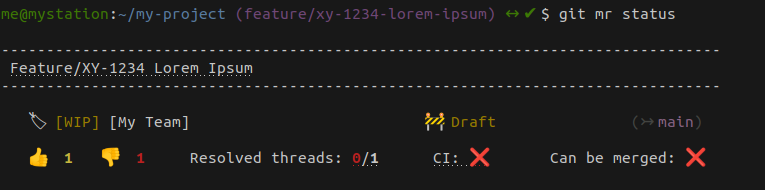
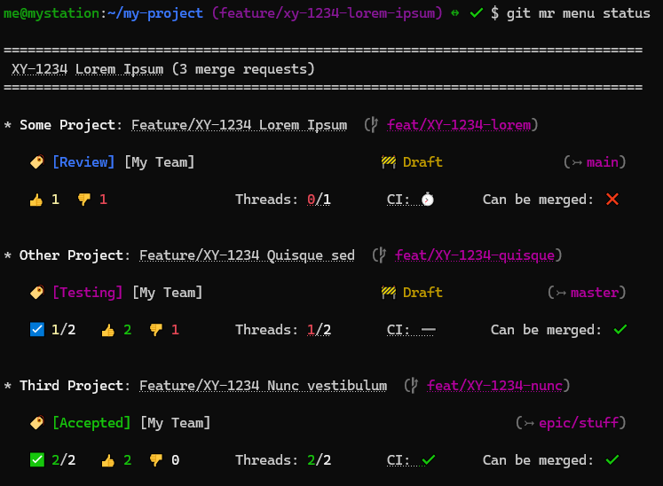

# git-mr

[](https://github.com/Djuuu/git-mr/actions/workflows/tests.yml)
[](https://web.archive.org/web/20160322002352/http://www.cs.trincoll.edu/hfoss/wiki/Chris_Fei:_Beerware_License)

Prepares a merge request description, with link to Jira ticket and current branch commit list.

----------------------------------------------------------------

* [Synopsis](#synopsis)
* [Installation](#installation)
    + [Command installation](#command-installation)
    + [Configuration](#configuration)
* [Commands](#commands)
    + [`git mr`](#git-mr-2)
    + [`git mr open`](#git-mr-open)
    + [`git mr status`](#git-mr-status)
    + [`git mr update`](#git-mr-update)
    + [`git mr menu`](#git-mr-menu)
    + [`git mr ip|cr|qa|ok`](#git-mr-ipcrqaok)
    + [`git mr undraft`](#git-mr-undraft)
    + [`git mr merge`](#git-mr-merge)
    + [`git mr hook`](#git-mr-hook)
* [Plumbing commands](#plumbing-commands)
  + [`git mr base`](#git-mr-base)
  + [`git mr code`](#git-mr-code)
* [Hooks](#hooks)
  + [`prepare-commit-msg`](#prepare-commit-msg)

----------------------------------------------------------------

## Synopsis

<pre>
<b>git mr</b>  <i>[OPTIONS]</i>          <i>[BRANCH]</i>
<b>git mr</b>  <i>[OPTIONS]</i>  <b>open</b>    <i>[BRANCH]</i>
<b>git mr</b>  <i>[OPTIONS]</i>  <b>status</b>  <i>[BRANCH]</i>
<b>git mr</b>  <i>[OPTIONS]</i>  <b>update</b>  <i>[BRANCH]</i>
<b>git mr</b>  <i>[OPTIONS]</i>  <b>merge</b>   <i>[BRANCH]</i>

<b>git mr</b>  <i>[OPTIONS]</i>  <b>menu</b>                     <i>[SEARCH_TERM]</i>
<b>git mr</b>  <i>[OPTIONS]</i>  <b>menu</b> <i>update [--current]</i>  <i>[SEARCH_TERM]</i>
<b>git mr</b>  <i>[OPTIONS]</i>  <b>menu</b> <i>status</i>              <i>[SEARCH_TERM]</i>

<b>git mr</b>  <i>[OPTIONS]</i>  <b>(ip|cr|qa|ok)</b>  <i>[BRANCH]</i>
<b>git mr</b>  <i>[OPTIONS]</i>  <b>undraft</b>        <i>[BRANCH]</i>

<b>git mr</b>  <b>base</b>  <i>[BRANCH]</i>
<b>git mr</b>  <b>code</b>  <i>[BRANCH]</i>

<b>git mr</b>  <b>hook</b>
</pre>

### Arguments

* `BRANCH`  
  Merge request source branch.  
  (Defaults to current branch.)

* `SEARCH_TERM`  
  Term searched in merge requests titles to build menu.  
  (Defaults to Jira issue code guessed from branch name.)

### Options

* `-c`, `--code` `ISSUE_CODE`  
  Force issue code.
* `-t`, `--target` `TARGET_BRANCH`  
  Force target branch.
* `-e`, `--extended`  
  Use full commit messages in description ("extended", for `git mr [open|update]`).  
  You can also set `GIT_MR_EXTENDED=1` in your environment variables to always use extended commit descriptions.
* `-s`, `--short`  
  Use short commit messages in description.  
  Useful when extended mode is enabled in configuration or environment.
* `--no-color`  
  Disable terminal colors.
* `--no-links`  
  Disable terminal hyperlinks and show merge request URL in `mr status` and `mr menu status`.
* `--no-commits`  
  Do not display the list of commits in the merge request description.
* `-y`, `--yes`  
  Bypass confirmation prompts (always answer "yes").
* `-v`, `--verbose`  
  Verbose output (displays called API URLs).
* `-h`  
  Show help page.

#### Command-specific options

* `git mr update`
  * `-n`, `--new-section` `[NEW_SECTION_TITLE]`  
    Add new section in description for new commits.
  * `-r`, `--replace-commits`  
    Fully replace commit list in description with current commits.

* `git mr menu update`
  * `--current`  
    Update only current project/branch merge request.

* `git mr merge`
  * `-f`, `--force`  
    Force merge even if there are unresolved threads.

## Installation

### Command installation

#### Dependencies

* `bash`, `git` and usual command-line utilities: `grep`, `sed`, `curl`, `head`, `tail`, `tr`.
* [**`jq`**](https://stedolan.github.io/jq/) is required and needs to be in PATH.

**Note for macOS users:**  
> macOS usually comes with a pretty outdated version of Bash (3.x) and the BSD versions of `grep` and `sed`.  
> You will need to install a more recent versions of bash (>=4.x) and the GNU versions of `sed` and `grep`.  
> These are available on Homebrew:
> ```shell
> brew install bash gnu-sed grep
> ```
> git-mr detects these versions, so no additional path adjustments should be necessary.

#### git-mr

* Add the `git-mr` directory to your `PATH`  
  in one of your shell startup scripts:
  ```bash
  PATH="${PATH}:/path/to/git-mr"
  ```

_OR_ 

* Define it as a Git alias:  
  run:
  ```bash
  git config --global alias.mr '!bash /path/to/git-mr/git-mr'
  ```
  or edit your `~/.gitconfig` directly:
  ```
  [alias]
  	mr = "!bash /path/to/git-mr/git-mr"
  ```

#### Completion

Completion functions for Bash and Zsh are available:

* **Bash**  
  Source `git-mr-completion.bash` in one of your shell startup scripts (`.bashrc` / `.bash_profile`):
  ```bash
  . "/path/to/git-mr/git-mr-completion.bash"
  ```

* **Zsh**   
  Add the `completion` directory to your `fpath` (in your `.zshrc`, before any call to `compinit` or `oh-my-zsh.sh`)
  ```zsh
  fpath=("/path/to/git-mr/completion" $fpath)
  ```
  You may have to force a rebuild of `zcompdump` by running:
  ```zsh
  rm -f ~/.zcompdump; compinit
  ```

### Configuration

Git-mr can either be configured through [git-config](https://git-scm.com/docs/git-config) or environment variables.

When using Git configuration, project-specific overrides can be set by omitting the `--global` option:
```bash
# Global configuration stored in your ~/.gitconfig
git config --global mr.global-option "global-value"

# Local configuration stored in current project's .git/config
git config mr.local-option "local-value"
```

Environment variables take precedence over Git configuration.

#### Git configuration reference

```bash
# Required configuration -------------------------------------------------------

git config --global mr.jira-instance "mycompany.atlassian.net"
git config --global mr.jira-user     "user.name@mycompany.com"
git config --global mr.jira-token    "abcdefghijklmnopqrstuvwx"

git config --global mr.jira-code-pattern "[A-Z]{2,3}-[0-9]+"

git config --global mr.gitlab-domain "myapp.gitlab.com"
git config --global mr.gitlab-token  "Zyxwvutsrqponmlkjihg"

# Optional configuration -------------------------------------------------------

# Default labels for new merge requests
git config --global mr.gitlab-default-labels "Review,My Team"

# Check "Delete source branch" by default (defaults to 1)
# git config --global mr.gitlab-remove-source-branch-on-merge 1

# Gitlab status labels (comma-separated, without spaces in between)
git config --global mr.gitlab-ip-labels "WIP"
git config --global mr.gitlab-cr-labels "Review"
git config --global mr.gitlab-qa-labels "Testing"
git config --global mr.gitlab-ok-labels "Accepted"

# Jira status - transition IDs
git config --global mr.jira-ip-id "xx"
git config --global mr.jira-cr-id "xx"
git config --global mr.jira-qa-id "xx"
git config --global mr.jira-ok-id "xx"

# Always use extended commit messages
# git config --global mr.git-mr-extended 1

# Required upvote count to turn indicator green in `mr status` (defaults to 2)
# git config --global mr.git-mr-required-upvotes 2

# Limit merge request search for menu to given group (empty by default, useful on gitlab.com)
# git config --global mr.gitlab-mr-limit-group "my-company"

# Limit project name search to the ones you are a member of (defaults to 1, useful on gitlab.com)
# git config --global mr.gitlab-projects-limit-member 1

# Network timeout (in seconds, defaults to 10)
# git config --global mr.git-mr-timeout 10
```

**Tip:**  
If you need distinct configuration "sets" but don't want to repeat the same values over and over 
in multiple projects, you might want to use [Git config includes](https://git-scm.com/docs/git-config#_includes).

#### Environment variables reference

```bash
# Required configuration -------------------------------------------------------

export JIRA_INSTANCE="mycompany.atlassian.net"
export JIRA_USER="user.name@mycompany.com"
export JIRA_TOKEN="abcdefghijklmnopqrstuvwx"

export JIRA_CODE_PATTERN="[A-Z]{2,3}-[0-9]+"

export GITLAB_DOMAIN="myapp.gitlab.com"
export GITLAB_TOKEN="Zyxwvutsrqponmlkjihg"

# Optional configuration -------------------------------------------------------

# Default labels for new merge requests
export GITLAB_DEFAULT_LABELS="Review,My Team"

# Check "Delete source branch" by default (defaults to 1)
#export GITLAB_REMOVE_SOURCE_BRANCH_ON_MERGE=1

# Gitlab status labels (comma-separated, without spaces in between)
export GITLAB_IP_LABELS="WIP"
export GITLAB_CR_LABELS="Review"
export GITLAB_QA_LABELS="Testing"
export GITLAB_OK_LABELS="Accepted"

# Jira status - transition IDs
export JIRA_IP_ID="xx"
export JIRA_CR_ID="xx"
export JIRA_QA_ID="xx"
export JIRA_OK_ID="xx"

# Always use extended commit messages
# export GIT_MR_EXTENDED=1

# Required upvote count to turn indicator green in `mr status` (defaults to 2)
#export GIT_MR_REQUIRED_UPVOTES=2

# Limit merge request search for menu to given group (empty by default, useful on gitlab.com)
#GITLAB_MR_LIMIT_GROUP="my-company"

# Limit project name search to the ones you are a member of (defaults to 1, useful on gitlab.com)
#GITLAB_PROJECTS_LIMIT_MEMBER=1

# Network timeout (in seconds, defaults to 10)
#export GIT_MR_TIMEOUT=10
```

#### Jira & Gitlab tokens

To create a Jira API Token, go to:
* https://id.atlassian.com/manage-profile/security/api-tokens  
  (Account Settings -> Security -> API Token -> Create and manage API tokens)

To create a Gitlab API Token, go to:
* https://myapp.gitlab.com/-/user_settings/personal_access_tokens  
  (Edit profile -> Access Tokens)  
  Required scope : `api`

## Commands

### `git mr`

<pre>
<b>git mr</b> <i>[OPTION...]</i> <i>[BRANCH]</i>
</pre>

This will print a merge request description, with a link to Jira ticket and current branch commit list.

* Issue code can be guessed from the branch name according to `JIRA_CODE_PATTERN`.  
  It can also be forced with the `-c|--code` option.
* Target branch is determined by going up the commit history and finding the first one attached to another local branch.  
  It can also be forced with the `-t|--target` option.

If a merge request based on the current branch is found on Gitlab, its URL will be provided, along with current votes, open and resolved threads and mergeable status.
Otherwise, a link to create a new merge request will be provided. 

Default labels and "Delete source branch" status can be configured with the `GITLAB_DEFAULT_LABELS` and `GITLAB_REMOVE_SOURCE_BRANCH_ON_MERGE` environment variables.


----------------------------------------------------------------

### `git mr open`

<pre>
<b>git mr</b> <i>[OPTION...]</i> <b>o|op|open</b> <i>[BRANCH]</i>
</pre>

Similar to `git mr`, but will open browser directly.

----------------------------------------------------------------

### `git mr status`

<pre>
<b>git mr</b> <i>[OPTION...]</i> <b>s|st|status</b> <i>[BRANCH]</i>
</pre>

Displays a quick summary of the merge request, with useful indicators (tags, target branch, votes, open threads, draft status, ...)



----------------------------------------------------------------

### `git mr update`

<pre>
<b>git mr</b> <i>[OPTION...]</i> <b>u|up|update</b> <i>[BRANCH]</i>
</pre>

This will:
* fetch and display the current merge request description from Gitlab.
* compare the commit lists and update the SHA-1 references in the description

If some commits were changed (after a rebase) or added, you will be prompted if you want to post the updated description to Gitlab.

You can also update the source branch if it is different from the current one.


#### Note on commit links

The initial merge request description lists commit SHA-1 and message in a simple format.

When Gitlab recognizes a partial Git SHA-1 in a description, it will automatically create a link to the commit,
but this link has no reference to the current merge request:
> `https://myapp.gitlab.com/my-project/-/commit/0a1b2c3d4e5f`

If a comment is created from this commit page, it might appear in the merge request at first, 
but **it will disappear as soon as the branch is rebased**.

Once the merge request exists, `git mr update` will convert SHA-1 references to **links to the commit in the merge request diff view**:
> `https://myapp.gitlab.com/my-project/-/merge_requests/123/diffs?commit_id=0a1b2c3d4e5f`

This view allows navigating through the merge request commits, and comments left on this page will remain attached to the merge request.


----------------------------------------------------------------

### `git mr menu`

<pre>
<b>git mr</b> <i>[OPTION...]</i> <b>menu</b>                       <i>[SEARCH_TERM]</i> 
<b>git mr</b> <i>[OPTION...]</i> <b>menu</b> <i>up|update [--current]</i> <i>[SEARCH_TERM]</i> 
<b>git mr</b> <i>[OPTION...]</i> <b>menu</b> <i>st|status</i>             <i>[SEARCH_TERM]</i> 
</pre>

Searches for all (non-closed) merge requests with the current issue code in the title, and generates a menu.

* `git mr menu`  
  Prints the markdown menu.

  

* `git mr menu up|update`  
  Inserts or updates menu in all related merge request descriptions (prompts for confirmation).

  

* `git mr menu up|update --current`  
  Inserts or updates menu in current merge request description only (prompts for confirmation).

* `git mr menu st|status`  
  Prints menu and status indicators for every related merge request.

  

----------------------------------------------------------------

### `git mr ip|cr|qa|ok`

<pre>
<b>git mr</b> <i>[OPTION...]</i> <b>ip|cr|qa|ok</b> <i>[BRANCH]</i>
</pre>

This will:
* Set Gitlab labels according to:
  - `GITLAB_IP_LABELS`
  - `GITLAB_CR_LABELS`
  - `GITLAB_QA_LABELS`
  - `GITLAB_OK_LABELS`
* transition Jira ticket using ID defined in:
  - `JIRA_IP_ID`
  - `JIRA_CR_ID`
  - `JIRA_QA_ID`
  - `JIRA_OK_ID`

#### `git mr ip` _("in progress")_
* removes Gitlab labels defined in `GITLAB_CR_LABELS`, `GITLAB_QA_LABELS` and `GITLAB_OK_LABELS`
* adds Gitlab labels defined in `GITLAB_IP_LABELS`
* sets Gitlab draft status
* transitions Jira ticket using `JIRA_IP_ID`

#### `git mr cr` _("code review")_
* removes Gitlab labels defined in `GITLAB_IP_LABELS`, `GITLAB_QA_LABELS`, and `GITLAB_OK_LABELS`
* adds Gitlab labels defined in `GITLAB_CR_LABELS`
* transitions Jira ticket using `JIRA_CR_ID`

#### `git mr qa` _("quality assurance")_
* removes Gitlab labels defined in `GITLAB_IP_LABELS`, `GITLAB_CR_LABELS`, and `GITLAB_OK_LABELS`
* adds Gitlab labels defined in `GITLAB_QA_LABELS`
* transitions Jira ticket using `JIRA_QA_ID`

#### `git mr ok` _("accepted")_
* removes Gitlab labels defined in `GITLAB_IP_LABELS`, `GITLAB_CR_LABELS`, and `GITLAB_QA_LABELS`
* adds Gitlab labels defined in `GITLAB_OK_LABELS`
* removes Gitlab draft status
* transitions Jira ticket using `JIRA_OK_ID`

----------------------------------------------------------------

### `git mr undraft`

<pre>
<b>git mr</b> <i>[OPTION...]</i> <b>undraft</b> <i>[BRANCH]</i>
</pre>

This will resolve the Gitlab _Draft_ (_Work in Progress_) status.

----------------------------------------------------------------

### `git mr merge`

<pre>
<b>git mr</b> <i>[OPTION...]</i> <b>m|mg|merge</b> <i>[BRANCH]</i>
</pre>

This will:
* check merge status
* check open threads
* check draft status

and if applicable, will prompt you to:
* resolve draft status
* trigger the merge
* checkout local target branch, update it and delete local merged branch


----------------------------------------------------------------

### `git mr hook`

<pre>
<b>git mr</b> <b>hook</b>
</pre>

Adds the `prepare-commit-msg` Git hook to your current repository.

----------------------------------------------------------------

## Plumbing commands

These "plumbing" commands can be useful in other scripts or git aliases.

### `git mr base`

Outputs guessed base branch.

----------------------------------------------------------------

### `git mr code`

Outputs guessed issue code.

----------------------------------------------------------------

## Hooks

The following hooks are provided for convenience:

### `prepare-commit-msg`

Ensures your commit messages are prefixed with the code of related issue.


